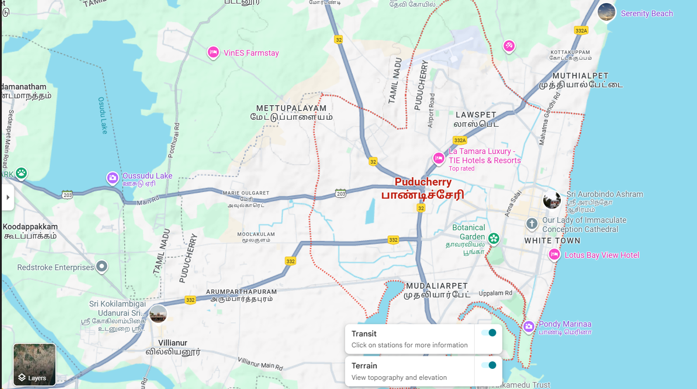
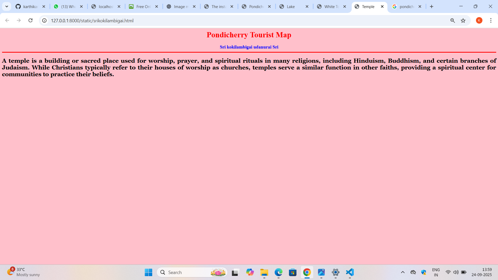
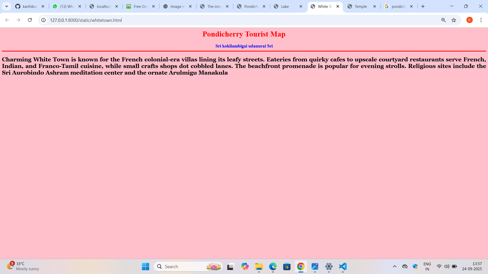

# Ex04 Places Around Me
## Date: 24/09/2025

## AIM:
To develop a website to display details about the places around my house.

## DESIGN STEPS:

### STEP 1:
Create a Django admin interface.

### STEP 2:
Download your city map from Google.

### STEP 3:
Using ```<map>``` tag name the map.

### STEP 4:
Create clickable regions in the image using ```<area>``` tag.

### STEP 5:
Write HTML programs for all the regions identified.

### STEP 6:
Execute the programs and publish them.

## CODE:

~~~
<!DOCTYPE html>
<html>
<head>
<title>Pondicherry Tourist Map</title>
</head>
<body>
<h1 align="center">
<font color="red"><b>Pondicherry Tourist Map</b></font>
</h1>
<h3 align="center">
    <font color="blue"><b>KARTHIK A(25016949)</b></font>
</h3>
<center>
    
    <map name="#Pondicherry Tourist Map">
        <area target="_blank" alt="Tourist Place" title="Tourist Place" href="whitetown.html" coords="1142,525,1450,605" shape="rect">
        <area target="_blank" alt="Temple" title="Temple" href="srikokilambigai.html" coords="169,679,384,764" shape="rect">
        <area target="_blank" alt="Lake" title="Lake" href="oussudulake.html" coords="213,385,401,451" shape="rect">
        <area target="_blank" alt="Beach" title="Beach" href="pondymarina.html" coords="1167,713,1365,782" shape="rect">
    </map>
</center>
</body>
</html>

oussudulake.html

<html>
    <head>
    <title>Lake</title>
    </head>
    <body bgcolor="purple">
    <h1 align="center">
    <font color="red"><b>Pondicherry Tourist Map</b></font>    
    </h1>    
    <h3 align="center">
    <font color="Green"><b>Osuddu Lake</b></font>    
    <hr size="3" color="red">
    <p align="justify">
    <font face="Georgia" size="5" color="White">
    A lake is a large body of surface water completely surrounded by land, existing in a natural or man-made basin. Unlike rivers, lakes are generally stationary, though many are fed by or drain into rivers and streams. They vary in size and can be  or salt water, supporting diverse ecosystems and serving important functions for humans, such as providing drinking water, electricity, and recreation.  
    </font>    
    </p>    
    </body>
</html>

pondymarina.html

<html>
    <head>
    <title>Lake</title>
    </head>
    <body bgcolor="purple">
    <h1 align="center">
    <font color="red"><b>Pondicherry Tourist Map</b></font>    
    </h1>    
    <h3 align="center">
    <font color="Green"><b>Pondy Marina</b></font>    
    <hr size="3" color="red">
    <p align="justify">
    <font face="Georgia" size="5" color="Yellow">
    Pondy Marina refers to Pondicherry Marina Beach, a popular tourist attraction located in the Union Territory of Puducherry, India, along the Bay of Bengal. It is a scenic spot known for its vibrant atmosphere, beautiful sunsets, and various recreational and cultural activities, including water sports like jet skiing and kayaking, camel rides, and a variety of food options available at its food court. The area is also a hub for photographers and a great place to relax or enjoy the ocean views.      
    </font>    
    </p>    
    </body>
</html>

srikokilambigai.html

<html>
    <head>
    <title>Temple</title>
    </head>
    <body bgcolor="pink">
    <h1 align="center">
    <font color="red"><b>Pondicherry Tourist Map</b></font>    
    </h1>    
    <h3 align="center">
    <font color="blue"><b>Sri kokilambigai udanurai Sri</b></font>    
    <hr size="3" color="red">
    <p align="justify">
    <font face="Georgia" size="5">
    A temple is a building or sacred place used for worship, prayer, and spiritual rituals in many religions, including Hinduism, Buddhism, and certain branches of Judaism. While Christians typically refer to their houses of worship as churches, temples serve a similar function in other faiths, providing a spiritual center for communities to practice their beliefs.      
    </font>    
    </p>    
    </body>
</html>

whitetown.html

<html>
    <head>
    <title>White Town</title>
    </head>
    <body bgcolor="pink">
    <h1 align="center">
    <font color="red"><b>Pondicherry Tourist Map</b></font>    
    </h1>    
    <h3 align="center">
    <font color="blue"><b>Sri kokilambigai udanurai Sri</b></font>    
    <hr size="3" color="red">
    <p align="justify">
    <font face="Georgia" size="5">
    Charming White Town is known for the French colonial-era villas lining its leafy streets. Eateries from quirky cafes to upscale courtyard restaurants serve French, Indian, and Franco-Tamil cuisine, while small crafts shops dot cobbled lanes. The beachfront promenade is popular for evening strolls. Religious sites include the Sri Aurobindo Ashram meditation center and the ornate Arulmigu Manakula 
    </font>    
    </p>    
    </body>
</html>

~~~

## Output:

.png>)






## RESULT
The program for implementing image maps using HTML is executed successfully.
